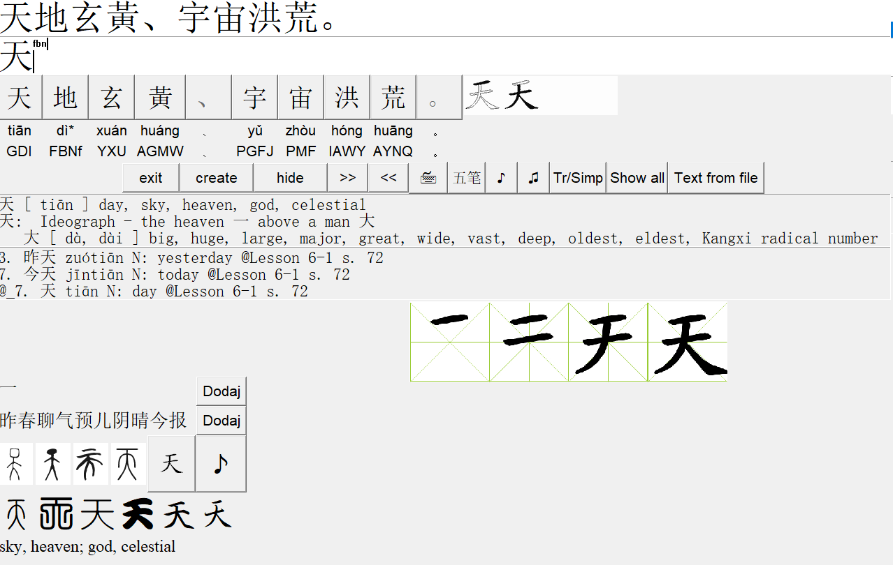

# Chinese Characters
Program for learn and train Chinese characters
## Table of contents
* [General info](#general-info)
* [Technologies](#technologies)
* [Screenshot](#Screeshot)
* [Sources](#Sources)

## General info
Program for learn and train Chinese characters. You can write (or copy Ctrl-v) Chinese words and receive any information, like writing or pronounciation as meaning as well.
Pictures are only examples, vocabulary and pictures are in files not included, as fonts are.

	
## Technologies
Project is created with:
* Python 3.7.0
* with tkinter
* and also winsound for Windows
	
## Screenshot

## Sources
Pictures of font and Chinese pronounciation files are available from: [@Arch Chinese](http://www.archchinese.com/chinese_english_dictionary.html)
Wubi code: [@Zdic](http://www.zdic.net)
